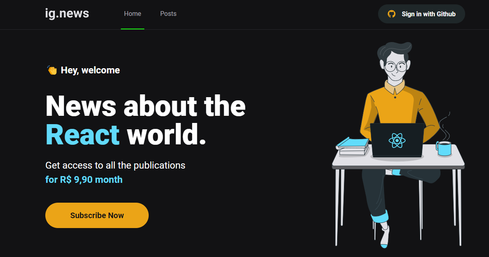

[](https://github.com/gutoo01/template-ignews-03-nextjs-basic/blob/main/README.md)
[](https://github.com/gutoo01/template-ignews-03-nextjs-basic/blob/main/README.pt-br.md)

# **Ignews**

<!---These are examples. See https://shields.io for others or to customize this shield set. You might want to include dependencies, project status and license information here--->



> Newsletter application where user will buy subscription. Once you have access to the content, you can create posts. Unsubscribed users will only be able to view the contents of the Post.

#

### The project is still under development and the next updates will focus on the following tasks:

- [x] Application layout
- [x] Style the application with SASS
- [x] JWT authentication via NextAuth
- [x] Create Posts Route Page
- [x] Integrate oAuth with FaunaDB
- [ ] Integrate Stripe Payment API
- [ ] Integrate payment API with FaunaDB
- [ ] Implement via CMS Prismic

#
## 💻 Prerequisites:

Before starting, check the following requirements:

- Requires versions:

```
"@stripe/stripe-js": "^1.41.0",
"faunadb": "^4.7.0",
"sass": "^1.49.0",
"stripe": "^10.14.0",
"@prismicio/client": "^6.7.1",
"@prismicio/next": "^0.1.7"
```

## 🚀 Installing **ignnews**

To install **Ignews**, follow these steps:

Win, Linux and macOS:

```
npm i
or
yarn
```
to Run app:
```
npm run dev
or
yarn dev
```

#
## 🫱🏻‍🫲🏽 Instructors


We thank the following people who contributed to this project:

<table>
  <tr>
    <td align="center">
      <a href="#">
        <br>
        <sub>
          <b>Diego Fernandes</b>
        </sub>
      </a>
    </td>
    <td align="center">
      <a href="#">
        <br>
        <sub>
          <b>Mayk Brito</b>
        </sub>
      </a>
    </td>
    <td align="center">
      <a href="#">
        <br>
        <sub>
          <b>Jakeliny Gracielly</b>
        </sub>
      </a>
    </td>
  </tr>
</table>

[⬆ Back to top](#project-name)<br>
