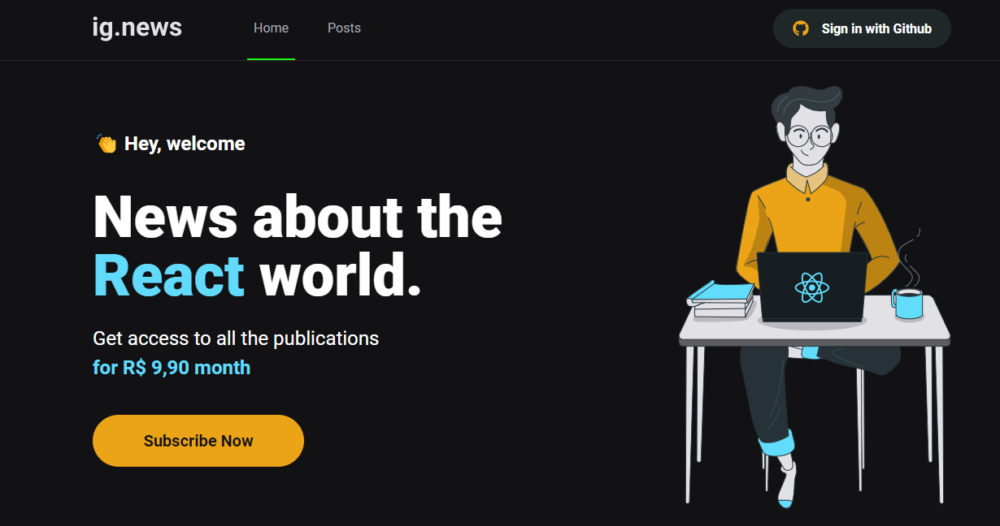

[](https://github.com/gutoo01/template-ignews-03-nextjs-basic/blob/main/readme.md)
[](https://github.com/gutoo01/template-ignews-03-nextjs-basic/blob/main/readme.pt-br.md)

# **Ignews**

<!---Esses são exemplos. Veja https://shields.io para outras pessoas ou para personalizar este conjunto de escudos. Você pode querer incluir dependências, status do projeto e informações de licença aqui--->



> Aplicação de newsletter onde usuário irá comprar assinatura. Obtendo acesso aos conteúdos poderá criar postagens. Usuários não assinados poderão apenas vizualizar os conteúdos do Post.

#

### O projeto ainda está em desenvolvimento e as próximas atualizações serão voltadas nas seguintes tarefas:

- [x] Layout da aplicação
- [x] Estilizar a aplicação com SASS
- [x] Autenticação JWT via NextAuth
- [x] Criar página rota de Posts
- [x] Integrar oAuth com FaunaDB
- [ ] Integrar API de pagamento Stripe
- [ ] Integrar API de pagamento ao FaunaDB
- [ ] Implementar via CMS Prismic

#
## 💻 Pré-requisitos:

Antes de começar, verifique os seguintes requisitos:

- Requer versões:  

```
"@stripe/stripe-js": "^1.41.0",
"faunadb": "^4.7.0",
"sass": "^1.49.0",
"stripe": "^10.14.0",
"@prismicio/client": "^6.7.1",
"@prismicio/next": "^0.1.7"
```

## 🚀 Instalando **ignews**

Para instalar o **Ignews**, siga estas etapas:

Win, Linux e macOS:

```
npm i
or
yarn
```
to Run app:
```
npm run dev
or
yarn dev
```

#
## 🫱🏻‍🫲🏽 Instrutores

Agradecemos às seguintes pessoas que contribuíram para este projeto:

<table>
  <tr>
    <td align="center">
      <a href="#">
        <br>
        <sub>
          <b>Diego Fernandes</b>
        </sub>
      </a>
    </td>
    <td align="center">
      <a href="#">
        <br>
        <sub>
          <b>Mayk Brito</b>
        </sub>
      </a>
    </td>
    <td align="center">
      <a href="#">
        <br>
        <sub>
          <b>Jakeliny Gracielly</b>
        </sub>
      </a>
    </td>
  </tr>
</table>

[⬆ Voltar ao topo](#nome-do-projeto)<br>
